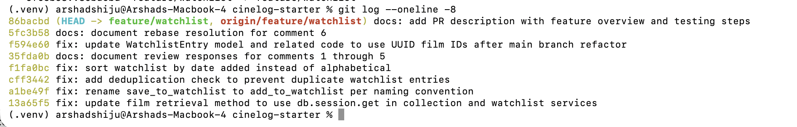

# PR Response Doc — CineLog Watchlist Feature

## AI Usage

I used Claude throughout this project in several ways:

**Codebase orientation:** Before touching any review comments, I had Claude
help me read through `models.py`, `services/collection_service.py`, and
`tests/test_collection.py` to understand the existing naming conventions,
the deduplication pattern used in `add_to_collection()`, and the test
fixture structure, before applying the same patterns to the watchlist code.

**Code changes (Comments 1, 2, 3, 6):** I used Claude to help me write the
rename, deduplication check, and test file changes, working from the
existing `add_to_collection()` pattern as a template. For Comment 6 (the
rebase), Claude helped me diagnose why `WatchlistEntry` had gone missing
from `models.py` after the rebase (the patch didn't cleanly apply against
the refactored file), and helped me reconstruct the model with the
UUID-compatible `film_id` column.

**Git workflow help:** I used Claude for step-by-step guidance through
unfamiliar git operations — fetching and rebasing onto `origin/main`,
resolving the missing-model issue, and running the interactive rebase
(`git rebase -i`) to clean up my commit history, including recovering from
an editor error mid-rebase using `git commit --amend`.

**Stress-testing my design reasoning (Comments 4 and 5):** I wrote my own
initial positions on both the default visibility question and the sort
order question based on my own experience as a Letterboxd user, then used
Claude to check whether my reasoning held up and to help me put it into
clear, structured prose. The core positions and the "why" behind them 
private by default because a watchlist reveals current interest before
something's been watched, and recency over alphabetical because a
watchlist behaves like a queue, not a catalog — are my own reasoning, not
generated by AI.

**Documentation:** I used Claude to help me draft `pr-response.md` entries
in the format the project asked for, and to draft the final PR description,
based on the actual changes I made and decisions I reasoned through
throughout the project.

## Comment 1 — Rename
**What I did:** Renamed `save_to_watchlist()` to `add_to_watchlist()` in
`services/watchlist_service.py` to match the project's `verb_to_noun` naming
convention already used by `add_to_collection()`, `remove_from_collection()`,
and `get_collection()`. Updated the one call site in
`routes/watchlist/watchlist.py` (both the import and the function call).
**How I verified:** Ran `grep -rn "save_to_watchlist" .` to confirm no
remaining references to the old name anywhere in the codebase, then ran
`pytest tests/ -v` to confirm nothing broke.

## Comment 2 — Deduplication
**What I did:** Added a duplicate check to `add_to_watchlist()`, mirroring
the pattern already used in `add_to_collection()`: after confirming the film
exists, query for an existing `WatchlistEntry` with the same `user_id` and
`film_id`. If one exists, raise a new `AlreadyInWatchlistError` instead of
creating a duplicate row.
**How I verified:** Ran `pytest tests/ -v` after the change to confirm
existing tests still pass, and added a dedicated test
(`test_add_to_watchlist_duplicate_raises`) confirming that adding the same
film twice raises `AlreadyInWatchlistError` and that only one entry exists
in the database afterward.

## Comment 3 — Missing test
**What I did:** Created `tests/test_watchlist.py`, modeled directly on
`test_add_to_collection_nonexistent_film_raises` from `test_collection.py`.
Added `test_add_to_watchlist_nonexistent_film_raises`, which confirms that
calling `add_to_watchlist()` with a film_id that doesn't exist raises
`FilmNotFoundError`. I also added two additional tests beyond what was
strictly requested — a happy-path test (`test_add_to_watchlist_creates_entry`)
and a duplicate test (`test_add_to_watchlist_duplicate_raises`) — to match
the same three-part coverage (happy path, duplicate, nonexistent ID) that
`CONTRIBUTING.md` requires for new service functions.
**How I verified:** Ran `pytest tests/test_watchlist.py -v` to confirm all
three new tests pass, then `pytest tests/ -v` to confirm the full suite
still passes together.

## Comment 4 — Default visibility
**My position:** Watchlists should default to `public=False`, not `True`.

**Reasoning:** A watchlist is different from a collection — it's a list of
films someone hasn't watched yet, which can reveal more about a person's
current interests or mood than a list of films they've already finished.
Users should have to opt in to sharing that, not opt out. This also matches
how I use similar apps myself — as a Letterboxd user, I always set my own
watchlist to private, since it's a personal planning list rather than
something I default to sharing. Defaulting to private respects that most
users won't have thought about the visibility of a feature they haven't
used yet, and it's much easier to make something public later (a deliberate
choice) than to discover it was public the whole time (an accidental
exposure).

**Tradeoff acknowledged:** The original default (`public=True`) optimizes
for CineLog's community aspect — public watchlists could drive discovery,
letting users see what films are trending among people they follow.
Defaulting to private sacrifices some of that discovery value, since fewer
watchlists will be visible unless users actively opt in. I think that
tradeoff is worth it here because the downside of over-sharing (unintentional
exposure) is worse than the downside of under-sharing (slightly less
discovery), especially for a feature users haven't had a chance to
understand yet.

## Comment 5 — Sort order
**My position:** I agree with the maintainer — sort by date added
(newest first), not alphabetical.

**Reasoning:** A watchlist is inherently a "what's next" list, not a
reference list. Most people build it up over time and want to see what
they just added, either because it's top of mind or because they're
deciding what to watch tonight. Alphabetical order is more useful for
looking something up you already know is there — closer to how you'd use
an already-watched collection — but a watchlist behaves more like a queue.

**Engagement with reviewer's point:** The maintainer's reasoning — "most
users want to see what they added recently" — matches my own experience
with similar watchlist features: I rarely scroll alphabetically to find
something to watch, I look at what's newest because that's usually what
I was just thinking about when I added it. Sorting by `date_added`
descending also keeps this consistent with `get_collection()`, which
already sorts newest first, so the two features behave the same way from
a user's perspective instead of introducing an unexplained inconsistency
between them.

## Comment 6 — Rebase
**What conflicted:** While my `feature/watchlist` branch was open, `main` was
refactored to migrate `Film.id` from an `Integer` to a UUID string
(`refactor: migrate film IDs from integer to UUID`). My branch's
`WatchlistEntry` model still defined `film_id` as `db.Integer`, and
`services/watchlist_service.py` / `routes/watchlist/watchlist.py` both
had docstrings and type expectations assuming integer film IDs.

**How I resolved it:** After running `git fetch origin` and
`git rebase origin/main`, the `WatchlistEntry` model was missing from
`models.py` post-rebase. I re-added it with `film_id` typed as
`db.String(36)` with a foreign key to `film.id`, matching the UUID pattern
already used by `CollectionEntry`. I also updated the docstrings in
`watchlist_service.py` and `routes/watchlist/watchlist.py` that referenced
integer film IDs, and updated `tests/test_watchlist.py`'s nonexistent-film
test to use a UUID string (`"00000000-0000-0000-0000-000000000000"`)
instead of an integer placeholder, since `Film.id` is now a UUID.

**How I verified no conflict remains:** Ran `pytest tests/ -v` to confirm
all 7 tests pass against the post-refactor schema, and ran
`git log --oneline --merges` to confirm no merge commits exist in the
branch history.

## PR Description

This PR adds a watchlist feature to CineLog, letting users save films they
want to watch later, view their watchlist, and remove films from it.
Watchlist entries are deduplicated per user/film pair, matching the existing
collection feature's behavior.

**Design decisions:**
- **Default visibility:** Watchlist entries default to `public=False`
  (private). Since a watchlist reveals a user's current interests before
  they've watched something, users should opt in to sharing it rather than
  opt out.
- **Sort order:** Watchlists are sorted by date added (newest first),
  matching `get_collection()`'s behavior, since users are more likely to
  want to see what they just added than to browse alphabetically.

**Manual testing steps:**
1. Start the server: `python app.py`
2. Create a user and a film via the existing `/collection` or database
   fixtures (or use existing seed data if available)
3. Add a film to the watchlist:
   `curl -X POST http://127.0.0.1:5000/watchlist/<user_id>/add -H "Content-Type: application/json" -d '{"film_id": "<film_uuid>"}'`
4. View the watchlist: `curl http://127.0.0.1:5000/watchlist/<user_id>`
   — confirm the film appears, sorted newest-first if multiple entries exist
5. Try adding the same film again — confirm it returns an error instead of
   creating a duplicate
6. Run the automated test suite: `pytest tests/ -v` — all 7 tests should pass

## Stretch Features

**`remove_from_watchlist()`:** Added a new service function mirroring
`remove_from_collection()`'s pattern — it looks up the `WatchlistEntry` for
the given `user_id`/`film_id`, raises a new `NotInWatchlistError` if no
entry exists, and deletes it otherwise. Wired up a corresponding
`DELETE /watchlist/<user_id>/remove` route in `routes/watchlist/watchlist.py`,
following the same request/response shape as the collection route's
`remove_film` endpoint. Added two tests: one confirming a successful
removal deletes the entry, and one confirming that removing a film not on
the watchlist raises `NotInWatchlistError`.

**Second test (edge case):** I added
`test_remove_from_watchlist_only_removes_target_film`, which adds two
different films to the same user's watchlist, removes one, and asserts
that only the targeted film is gone while the other remains. I chose this
edge case because deletion bugs that accidentally cascade or over-delete
are a common real-world failure mode, and it wasn't covered by the
required nonexistent-film test — that test only checks the "nothing to
delete" case, not whether a delete operation might unintentionally affect
other rows for the same user.

**Visibility toggle:** Added an optional `public` parameter to
`add_to_watchlist()`. If omitted, the entry falls back to the model's
default (private, per my Comment 4 reasoning). If explicitly passed,
it overrides the default — so a caller can create a public watchlist
entry on purpose rather than only being able to change visibility after
the fact. Wired the same `public` field through the
`POST /watchlist/<user_id>/add` route body. Added two tests: one
confirming `public=True` is respected when passed explicitly, and one
confirming the default stays private when omitted.